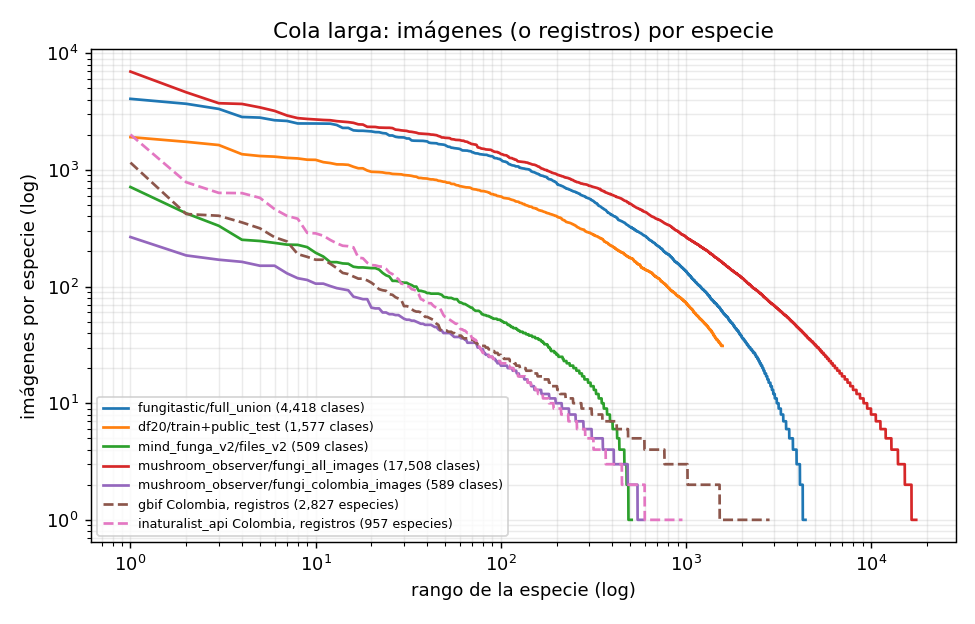

# Auditoría de datasets — Semana 2

> Fecha de acceso a las fuentes: **2026-09-18**. Todas las cifras de este informe se leen de los resultados generados en [`reports/audit/`](audit/) y de los manifiestos de [`data/manifests/`](../data/manifests/); se regeneran con `python scripts/data/audit_datasets.py`.

## 1. Objetivo

Esta semana se hizo el **inventario y la auditoría inicial** de las fuentes de datos de hongos (Fase 2: auditoría y curaduría): cuántas imágenes y observaciones hay o son accesibles, qué metadatos ofrece cada fuente, cuántos valores faltan, qué duplicados pueden detectarse, cómo es el desbalance de clases y qué problemas o riesgos aparecen. **No se modificó ningún dato**: no se eliminó, corrigió, imputó, deduplicó, normalizó ni particionó nada, y no se combinaron datasets (cada uno se audita por separado; solo se calcularon intersecciones de identificadores para medir solapamientos).

**Enfoque *metadata-first*.** Se descargaron metadatos, índices, taxonomías y respuestas de APIs (721,5 MB en 118 archivos locales, ver [`raw_files.csv`](../data/manifests/raw_files.csv)); **no se descargó ninguna imagen**.

**Etiquetas de evidencia** (usadas en el inventario y en este informe):

| Etiqueta | Significado |
|---|---|
| `SOURCE_REPORTED` | Cifra o afirmación publicada por la fuente (documentación, artículo, ficha, conteo de la API en la fecha de consulta). |
| `LOCAL_VERIFIED` | Calculada por nosotros sobre archivos descargados. Ojo: las cifras de «imágenes» son **filas/entradas de metadatos**; los archivos de imagen no se comprobaron. |
| `DERIVED` | Deducida en memoria (p. ej. género tomado del nombre científico o de la carpeta) o calculada sobre una muestra. |
| `NOT_VERIFIED` | No fue posible comprobarla. |

**Estados de acceso** (`status` en el inventario): `AVAILABLE_LOCAL` (el recurso completo está en local), `METADATA_AVAILABLE` (metadatos oficiales completos en local, imágenes no), `REMOTE_QUERYABLE` (consultable por API/HTTP; solo hay conteos, muestras o índices), `DOCUMENTED_ONLY`, `ACCESS_PROBLEM` y `REQUIRES_REVIEW`. La aptitud para clasificación visual se indica aparte (`visual_suitability`), porque una fuente puede estar completa en local y aun así ser inútil como dataset de imágenes.

## 2. Fuentes revisadas

| dataset_id | Fuente | Estado | Datos locales | Aptitud visual | Licencia (resumen) |
|---|---|---|---|---|---|
| `fungitastic` | FungiTastic | `METADATA_AVAILABLE` | metadatos completos (CSV, sin imágenes) | `SUITABLE_CANDIDATE` | Inconsistente: artículo «CC BY 4.0»; Kaggle «CC BY-NC-SA 4.0»; código BSD-3 |
| `fungitastic_aux_modalities` | FungiTastic — clima, satélite y máscaras | `ACCESS_PROBLEM` | ninguno | `NOT_VERIFIED` | NA |
| `df20` | Danish Fungi 2020 (DF20) | `METADATA_AVAILABLE` | metadatos completos (CSV, sin imágenes) | `SUITABLE_CANDIDATE` | Artículo CC BY 4.0; el sitio no declara licencia del dataset; autor por imagen |
| `mind_funga_v2` | MIND.Funga App — dataset de imágenes de macrohongos neotropicales (v2) | `REQUIRES_REVIEW` | índice de archivos + nombres de carpeta (sin imágenes) | `REQUIRES_REVIEW` | CC BY-NC 3.0 |
| `inaturalist_api` | iNaturalist — plataforma y API v1 | `REMOTE_QUERYABLE` | instantáneas JSON de consultas + muestra de 200 observaciones | `SUITABLE_CANDIDATE` | Por foto (CC0 … CC BY-NC-ND o todos los derechos reservados) |
| `inaturalist_open_data` | iNaturalist Open Data (GitHub + AWS Open Data) | `REMOTE_QUERYABLE` | taxonomía completa (taxa.csv.gz) + fragmentos de esquema | `SUITABLE_CANDIDATE` | Por foto (solo licencias abiertas) |
| `sib_colombia_portal` | SiB Colombia — portal de datos | `DOCUMENTED_ONLY` | ninguno (ver recursos sib_*) | `NOT_VERIFIED` | Por recurso |
| `sib_macrohongosmitu` | SiB Colombia IPT — Exploración y Valoración de la Diversidad Fúngica en cercanías de la comunidad Mitú-Cachivera | `AVAILABLE_LOCAL` | registros completos (DwC-A); sin imágenes | `NOT_SUITABLE` | CC BY 4.0 (recurso) |
| `sib_macrohongos_jbb_2023_1` | SiB Colombia IPT — Organismos asociados a las plantas: Fungario del Jardín Botánico José Celestino Mutis 2023-1 | `AVAILABLE_LOCAL` | registros completos (DwC-A); sin imágenes | `NOT_SUITABLE` | CC BY-NC 4.0 (recurso) |
| `sib_hongos_col2023` | SiB Colombia IPT — Hongos de Colombia (proyecto) | `AVAILABLE_LOCAL` | registros completos (DwC-A); sin imágenes | `NOT_SUITABLE` | CC0 1.0 (recurso) |
| `gbif` | GBIF — Global Biodiversity Information Facility | `REMOTE_QUERYABLE` | instantáneas JSON (conteos y 900 registros de muestra) | `SUITABLE_CANDIDATE` | Por registro/medio (CC0, CC BY, CC BY-NC, …) |
| `mushroom_observer` | Mushroom Observer | `METADATA_AVAILABLE` | metadatos completos (CSV, sin imágenes) | `SUITABLE_CANDIDATE` | Por imagen (varias CC) |

La justificación de cada estado y el siguiente paso recomendado están en las columnas `status_reason` y `recommended_next_step` de [`dataset_inventory.csv`](../data/manifests/dataset_inventory.csv), y hay un manifiesto por fuente en [`data/manifests/sources/`](../data/manifests/sources/).

**Comprobación de los enlaces suministrados** (HTTP GET, fecha de acceso; [`reachability_probes.json`](../data/raw/sources_documentation/api/reachability_probes.json), local):

| URL | HTTP | Comentario |
|---|---|---|
| `https://data.mendeley.com/datasets/sfrbdjvxcc/2` | 403 | La página responde con un desafío de Cloudflare a clientes automatizados; la API pública sí responde a `curl`. |
| `https://openaccess.thecvf.com/content/WACV2022/html/Picek_Danish_Fungi_2020_-Not_Just_Another_Image_Recognition_Dataset_WACV_2022_paper.html` | 404 | El enlace suministrado tiene un guion mal escrito (`-Not` en vez de `_-_Not`); la URL corregida responde 200. |
| `https://www.gbif.org/` | 403 | La web bloquea clientes automatizados; la API `api.gbif.org` sí responde (es la que se usó). |
| `https://www.gbif.org/occurrence/search?media_type=StillImage` | 403 | Ídem; se reprodujo la consulta con la API (`mediaType=StillImage`). |

Las otras 16 URLs suministradas respondieron 200.

## 3. Datos realmente accesibles

Tamaños locales según [`raw_files.csv`](../data/manifests/raw_files.csv) (incluyen las respuestas JSON de las APIs).

### 3.1 FungiTastic
* **Se obtuvo:** `metadata.zip` oficial (327.493.894 B, 327,5 MB), 13 CSV (completo: Train, ClosedSet-Val/Test, OpenSet-Val/Test, DNA-Test; Mini: 4; FewShot: 3). SHA-256 en `raw_files.csv`.
* **Versión:** Kaggle v15 (2025-12-03, ficha pública, 50,5 GB en total); `metadata.zip` con `Last-Modified` 2025-12-05; repositorio oficial, último commit `fb65b7e` (2025-10-15).
* **Método:** URL oficial del script `dataset/download.py --metadata` (`https://cmp.felk.cvut.cz/datagrid/FungiTastic/shared/download/metadata.zip`). El script oficial necesita `wget` (no disponible en Windows) y borra el ZIP tras extraerlo; por eso se descargó la misma URL con `requests` y se leen los CSV directamente del ZIP.
* **No se obtuvo:** imágenes (archivos oficiales por subconjunto/resolución, p. ej. `FungiTastic-train-300p.zip` 9,6 GB; Kaggle ≈ 50 GB a 500 px). Los enlaces `--size fullsize` del subconjunto Mini (4 archivos) devuelven **HTTP 404** (FungiTastic-Mini-dna-test-fullsize.zip, FungiTastic-Mini-test-fullsize.zip, FungiTastic-Mini-train-fullsize.zip, FungiTastic-Mini-val-fullsize.zip); el resto de tamaños responde 200. `climatic.zip` devuelve **HTTP 403** (satélite y máscaras responden 200, no se descargaron: 4,1 GB RGB, 3,6 GB NIR, 0,7 GB máscaras).

### 3.2 Danish Fungi 2020 (DF20)
* **Se obtuvo:** `DF20-metadata.zip` (29.089.651 B): `DF20-train_metadata_PROD-2.csv` y `DF20-public_test_metadata_PROD-2.csv`.
* **Versión:** archivos `PROD-2` (Last-Modified 2022-03-11). **No se obtuvo:** imágenes (`DF20-300px.tar.gz` 6,4 GB; `DF20-train_val.tar.gz` 115,7 GB). No se descargó `DF20M` (Mini, subconjunto).
* **Método:** `http://ptak.felk.cvut.cz/plants/DanishFungiDataset/DF20-metadata.zip` (enlace de la tabla de descargas del repositorio oficial).

### 3.3 MIND.Funga V2 (Mendeley Data)
* **Se obtuvo:** el índice completo de archivos de la versión 2 (JSON de la API pública de Mendeley: 18.023 archivos con tamaño y **SHA-256 publicado por la fuente**) y el directorio central del ZIP oficial (leído con 4 solicitudes HTTP *Range*, sin descargar imágenes) para conocer el nombre de carpeta (taxón) de cada archivo. Ambos índices coinciden: 18.023 entradas, 509 carpetas, 0 conflictos de correspondencia carpeta↔nombre.
* **Versión:** v2 (publicada 2023-07-11; la v1 es de 2022-09-15), DOI 10.17632/sfrbdjvxcc.2, licencia CC BY NC 3.0. ZIP completo: 3,24 GB (no descargado).
* **Limitación de acceso:** `data.mendeley.com` responde con un desafío de Cloudflare (HTTP 403) a las solicitudes hechas con `requests` de Python y a la página web; `curl` sí es atendido. Se usó `curl` para las 5 solicitudes necesarias (1 JSON + 4 *Range*); no se resolvió ni se simuló ningún desafío. El script de adquisición documenta esta decisión; si se prefiere no usar `curl` con esta fuente, hay que descargar el ZIP manualmente desde el navegador.

### 3.4 iNaturalist (API v1 y Open Data / AWS)
* **API:** 24 consultas pequeñas guardadas como instantáneas (29,0 MB): conteos de hongos en Colombia (`place_id=7196`, `taxon_id=47170`) por calidad y licencia de la foto, conteos por especie y una **muestra aleatoria de 200 observaciones** de grado de investigación con fotos. No se descargó ninguna foto.
* **Open Data:** se descargó `taxa.csv.gz` completo (39,8 MB, 1.659.638 taxones) y **fragmentos iniciales** (2 y 3 MB) de `observations.csv.gz` y `photos.csv.gz` solo para verificar el esquema (son las filas más antiguas: **no son representativas**). No se descargaron `observations.csv.gz` (13,1 GB) ni `photos.csv.gz` (20,1 GB) ni el tarball completo (35,1 GB): magnitud extraordinaria no justificada para la auditoría. Los objetos del bucket tienen `Last-Modified` 2026-08-27.
* **Hallazgo de esquema (`LOCAL_VERIFIED` en los fragmentos):** `observations.csv` solo tiene `observation_uuid, observer_id, latitude, longitude, positional_accuracy, taxon_id, quality_grade, observed_on, anomaly_score` — **no incluye país ni nombre del taxón** (hay que unir con `taxa.csv` y filtrar Colombia por coordenadas). Cada foto tiene `license`, y en el fragmento ninguna fila tiene la licencia vacía.

### 3.5 SiB Colombia (portal y tres recursos IPT)
* El portal `biodiversidad.co/data` es informativo (registros, listas, fichas, IPT); no se usó una API propia (`DOCUMENTED_ONLY`).
* De cada uno de los tres recursos IPT se descargó el **DwC-A completo** (versiones 1.1, 1.0 y 1.4; 90 kB en total). Ninguno contiene extensión multimedia y la columna `associatedMedia` está vacía en todos los registros: **no hay fotografías enlazadas** (0 de 1.706 registros).

### 3.6 GBIF
* La API pública responde; la web `gbif.org` bloquea clientes automatizados (no necesaria). Se guardaron 73 instantáneas (12,4 MB): conteos mundiales y de Colombia con `mediaType=StillImage`, facetas (dataset, licencia, base del registro, publicador, taxón), metadatos de los datasets principales y **900 registros de muestra** (3 páginas de 300, desplazamientos 0/6000/12000: **no es una muestra aleatoria estricta**). No se pidió ninguna descarga masiva (requiere cuenta).

### 3.7 Mushroom Observer
* Se descargaron los 6 volcados CSV nocturnos oficiales (258,0 MB; `Last-Modified` 2026-09-18). La documentación de MO pide usar estos CSV en lugar de la API para volúmenes grandes (la API limita a ~20 solicitudes/min y «no está pensada para extracción de datos»), por lo que no se consultó la API. Imágenes no descargadas.

## 4. Inventario de imágenes y observaciones

Se distingue siempre **imagen** de **observación** (varias fotos de un mismo hallazgo). «Verificado» = calculado por nosotros sobre metadatos locales (`LOCAL_VERIFIED`) — no sobre archivos de imagen. «Muestra» = `DERIVED` sobre una muestra, no sobre la fuente completa.

### 4.1 Reportado por la fuente vs. verificado localmente

| Fuente | Reportado por la fuente | Verificado / calculado por nosotros | Imágenes por observación (media / mediana / máx.) |
|---|---|---|---|
| FungiTastic (unión de los 6 CSV completos) | ≈350.000 obs. · 630.000 img. · ≈5.000 esp. (`SOURCE_REPORTED`; sitio: «>600.000 img.») | 346.459 obs. · 633.114 img. · 4.418 esp. · 1.406 gén. | 1,83 / 1 / 24 |
| DF20 (train + public test) | 295.938 img. · 1.604 «especies» · 566 gén. (artículo, Tabla 2) | 177.170 obs. · 295.938 img. · 1.577 esp. (binomios) / 1.604 clases · 566 gén. | 1,67 / 1 / 23 |
| MIND.Funga v2 | 17.467 img. · >500 taxones (Mendeley) | NA obs. (sin ID de observación) · 18.023 archivos · 509 carpetas (clases) · 346 binomios seguros · 240 gén. | NA |
| Mushroom Observer (hongos, Kingdom=Fungi) | NA | 608.302 obs. (589.304 con imágenes) · 1.924.184 img. · 17.986 esp. | 3,27 / 3 / 181 |
| Mushroom Observer — Colombia | NA | 21.019 obs. (20.973 con imágenes) · 61.351 img. · 592 esp. | 2,93 / 2 / 49 |
| iNaturalist API — hongos en Colombia | 127.886 obs. (todas las calidades; API, `SOURCE_REPORTED`); 127.632 con fotos; 16.480 grado de investigación; 2.447 especies | NA (solo muestra de 200 obs.: 2,34 fotos/obs. de media, máx. 20) | NA |
| iNaturalist Open Data | «más de 70 millones de fotos» (todos los taxones; README) | solo taxonomía: 71.045 taxones fúngicos activos (59.642 de rango especie; **no** son observaciones). Fragmento de fotos: 70.737 filas / 48.607 obs. (1,46 fotos/obs.) | NA |
| GBIF — hongos con StillImage en Colombia | 21.638 registros (API, `SOURCE_REPORTED`); mundo: 11.505.077 de 60.740.476 registros | NA (muestra de 900 registros: 2,15 imágenes/registro de media, máx. 20) | NA |
| SiB — Mitú-Cachivera | 60 registros (IPT) | 60 registros · **0 imágenes** · 25 esp. · 27 gén. | NA |
| SiB — Fungario JBB 2023-1 | 184 registros (IPT) | 184 registros · **0 imágenes** · 56 esp. · 44 gén. | NA |
| SiB — Hongos de Colombia 2023 | 1.462 registros (IPT) | 1.462 registros · **0 imágenes** · 24 esp. · 245 gén. | NA |

### 4.2 FungiTastic por partición (ver también `size_summary.csv`)

| Partición | Observaciones | Imágenes | Especies (nombre) | Clases (`category_id`) | Géneros | Img/obs (media/mediana/máx.) | Artículo (`SOURCE_REPORTED`) |
|---|---|---|---|---|---|---|---|
| Train | 246.884 | 433.702 | 2.786 | 2.829 | 918 | 1,76 / 1 / 24 | 246.884 obs. · 433.701 (una tabla) / 433.702 (otra tabla) img. |
| ClosedSet-Val | 45.613 | 89.659 | 2.275 | 2.306 | 830 | 1,97 / 2 / 24 | 45.613 obs. · 89.659 img. |
| ClosedSet-Test | 48.378 | 91.832 | 2.301 | 2.336 | 833 | 1,90 / 2 / 15 | 48.378 obs. · 91.832 img. |
| DNA-Test | 2.041 | 5.105 | 714 | 725 | 205 | 2,50 / 2 / 15 | 2.041 obs. · 5.105 img. |
| OpenSet-Val | 47.450 | 96.756 | 3.308 | 2.307 | 1.184 | 2,04 / 2 / 24 | NA |
| OpenSet-Test | 50.084 | 97.551 | 3.285 | 2.337 | 1.174 | 1,95 / 2 / 17 | NA |
| Mini (unión) | 36.215 | 67.634 | 210 | NA | 6 | 1,87 / 1 / 16 | Train/Val/Test: 25.786 + 4.687 + 5.531 obs. (46.842 + 9.412 + 10.738 img., 215/193/196 esp.); DNA (211 obs. locales) no figura en esa tabla |
| FewShot (unión) | 6.391 | 12.015 | 2.413 | NA | 1.014 | 1,88 / 1 / 30 | 6.391 obs. · 12.015 img. · 2.427 esp. |
| Completo (unión, sin repetidos) | 346.459 | 633.114 | 4.418 | NA | 1.406 | 1,83 / 1 / 24 | ≈350.000 obs. · 630.000 img. |

Las cifras de observaciones e imágenes de Train, Val, Test y DNA **coinciden con el artículo** (Train: 433.702 imágenes frente a 433.701 en una tabla del artículo y 433.702 en otra). El número de «clases» del artículo coincide con `category_id` (2.829 en Train, 725 en DNA), no con los nombres de especie distintos: 39 especies tienen más de un `category_id`/`scientificName` (variantes de autoría). Además, la unión completa contiene 4.418 nombres de especie pero solo 2.786 son clases conocidas (con `category_id` ≠ −1); las restantes aparecen únicamente como «desconocidas» en OpenSet (12.816 imágenes con `category_id = −1`).

### 4.3 DF20 por partición

| Partición | Observaciones (`gbifID`) | Imágenes | Especies (binomio) | Géneros | Familias | Img/obs (media/mediana/máx.) |
|---|---|---|---|---|---|---|
| train | 166.415 | 266.344 | 1.577 | 566 | 189 | 1,60 / 1 / 23 |
| public_test | 27.814 | 29.594 | 1.577 | 566 | 189 | 1,06 / 1 / 4 |
| train+public_test | 177.170 | 295.938 | 1.577 | 566 | 189 | 1,67 / 1 / 23 |

El total de imágenes (295.938) y los 566 géneros coinciden con el artículo; el artículo cuenta 1.604 «especies», que en los CSV son 1.604 `class_id`/`scientificName` (con variantes de autoría) frente a 1.577 binomios distintos (25 especies con más de un `class_id`); el artículo cuenta 190 familias y los CSV tienen 189.

## 5. Metadatos disponibles

Matriz calculada con las columnas presentes y su completitud en la tabla principal de cada fuente (`sí` ≤ 5 % ausente; `parcial` entre 5 % y 100 %; `no` = campo inexistente o vacío). Para fuentes sin tabla completa (APIs) se usó la muestra: es indicativo, no un porcentaje de la fuente. La matriz numérica está en [`metadata_matrix.csv`](audit/metadata_matrix.csv).

| Dataset | Taxonomía | ID observación | ID imagen | GPS (lat/lon) | Fecha | Sustrato | Hábitat | Clima | Licencia |
|---|---|---|---|---|---|---|---|---|---|
| `fungitastic` | sí | sí | sí | sí / sí | sí | sí | sí | archivo aparte (no verificado) | dataset (inconsistente) |
| `df20` | sí | sí | sí | sí / sí | sí | sí | sí | no | poco clara + autor/registro |
| `mind_funga_v2` | parcial | no | parcial | no / no | no | no | no | no | dataset |
| `inaturalist_api` | sí | sí | sí | sí / sí | sí | no | no | no | por foto |
| `inaturalist_open_data` | sí | sí | sí | sí / sí | sí | no | no | no | por foto |
| `sib_macrohongosmitu` | sí | sí | no | no / no | sí | no | no | no | recurso |
| `sib_macrohongos_jbb_2023_1` | sí | sí | no | sí / sí | sí | no | no | no | recurso |
| `sib_hongos_col2023` | parcial | sí | no | parcial / parcial | sí | no | no | no | recurso |
| `gbif` | sí | sí | sí | parcial / parcial | sí | no | parcial | no | por registro/medio |
| `mushroom_observer` | parcial | sí | sí | parcial / parcial | sí | no | no | no | por imagen |

Notas: (a) FungiTastic incluye además `elevation`, `landcover`, `biogeographicalRegion`, `poisonous`, `iucnRedListCategory` y una columna `captions` (texto generado); el clima y el satélite son archivos aparte (`climatic.zip` responde 403). (b) DF20 incluye `Substrate`, `Habitat`, `rightsHolder` (autor), `CoorUncert` y jerarquía administrativa. (c) MIND.Funga solo tiene nombre de archivo y carpeta (taxón); la agrupación por observación **no** está disponible. (d) `inaturalist_open_data`: los flags salen de la documentación y de los fragmentos (`taxa.csv` aporta la taxonomía). (e) Mushroom Observer: las coordenadas por observación existen solo en un tercio de las observaciones; el resto tiene solo la caja de localidad. (f) Los tres recursos SiB Colombia son registros de especímenes/observaciones sin imágenes ni licencia por registro (la licencia está a nivel de recurso).

## 6. Valores faltantes

Porcentaje de valores ausentes (nulos + cadenas vacías + marcadores como `unknown`/`NA`) en la tabla principal de cada fuente auditada directamente (`LOCAL_VERIFIED`); las filas marcadas *(muestra)* son `DERIVED`. Detalle por campo (nulos, vacíos, marcadores especiales): [`missing_values.csv`](audit/missing_values.csv).

| Tabla | Filas | Especie | Género | Familia | Fecha | Latitud | Longitud | Sustrato | Hábitat | Licencia | Autor |
|---|---|---|---|---|---|---|---|---|---|---|---|
| FungiTastic (unión) | 633.114 | 0,00 % | 0,00 % | 0,90 % | 0,00 % | 0,00 % | 0,00 % | 4,85 % | 0,00 % | — | — |
| FungiTastic Train | 433.702 | 0,00 % | 0,00 % | 0,82 % | 0,00 % | 0,00 % | 0,00 % | 7,06 % | 0,00 % | — | — |
| DF20 | 295.938 | 0,01 % | 0,00 % | 0,89 % | 0,01 % | 0,00 % | 0,00 % | 0,52 % | 0,37 % | — | 0,00 % |
| MIND.Funga (archivos) | 18.023 | 18,49 % | 0,00 % | — | — | — | — | — | — | — | — |
| Mushroom Observer (obs. hongos) | 608.302 | 38,96 % | 10,18 % | 10,95 % | 0,00 % | 67,22 % | 67,22 % | — | — | — | — |
| Mushroom Observer Colombia (obs.) | 21.019 | 88,18 % | 46,41 % | 47,17 % | 0,00 % | 47,22 % | 47,22 % | — | — | — | — |
| SiB Mitú-Cachivera | 60 | 55,00 % | 1,67 % | 1,67 % | 0,00 % | 100,00 % | 100,00 % | — | 100,00 % | 100,00 % | 0,00 % |
| SiB Fungario JBB | 184 | 0,00 % | 46,74 % | 42,39 % | 0,00 % | 0,00 % | 0,00 % | — | 100,00 % | 100,00 % | 0,00 % |
| SiB Hongos de Colombia | 1.462 | 97,74 % | 16,21 % | 11,97 % | 0,00 % | 11,70 % | 65,12 % | — | — | 100,00 % | 0,00 % |
| GBIF Colombia (muestra) *(muestra)* | 900 | 14,56 % | 4,00 % | 0,11 % | 0,00 % | 14,89 % | 14,89 % | — | 79,22 % | 1,44 % | 0,67 % |
| iNaturalist API (muestra 200) *(muestra)* | 200 | 2,00 % | 0,00 % | — | 0,00 % | 0,00 % | 0,00 % | — | — | 0,00 % | 0,00 % |
| iNat Open Data: obs. (fragmento) *(fragmento antiguo)* | 43.784 | — | — | — | 0,41 % | 1,08 % | 1,08 % | — | — | — | 0,00 % |

«—» = el campo no existe en esa fuente. La «especie» de MIND.Funga y de MO es DERIVADA (ver adaptadores); en MO, `species` solo se rellena cuando el nombre tiene rango especie.

Hallazgos principales:

* **FungiTastic:** muy completo. Ausentes: sustrato 4,85 % (30.686 imágenes), familia 0,90 %, orden 0,13 %, coordenadas 7 imágenes; 6 coordenadas implausibles. Especie, género y fecha: 0 ausentes.
* **DF20:** sustrato 0,52 %, hábitat 0,37 %, familia 0,89 %; 32 imágenes sin `species`; 9 coordenadas implausibles.
* **MIND.Funga:** no hay observación, coordenadas, fecha, sustrato, hábitat ni autor. La etiqueta de carpeta contiene `sp.`/`aff.`/`cf.` (identificación incierta) en 163 de 509 carpetas (3.333 archivos, 18,5 %); ninguna carpeta es solo el género, aunque la documentación dice que se usa el género cuando no se pudo identificar la especie.
* **Mushroom Observer (Colombia):** 88,2 % de las observaciones no tienen identificación a nivel de especie y 46,4 % ni siquiera género; 47,2 % sin coordenadas propias (en todo el mundo: 67,2 %). La licencia solo falta en 2 imágenes y el titular en 1.640.
* **SiB — Mitú-Cachivera:** no hay coordenadas (100 % ausentes) ni especie/género en los términos estándar; el nombre del taxón está en texto libre (`organismName`, p. ej. «POLYPORACEAE - Favolus sp.») y la fecha en `year/month/day` (`eventDate` vacío): con esos campos alternativos (DERIVADOS) faltan 1,7 % de géneros y 55,0 % de especies (el resto son identificaciones tipo `sp.`). **`verbatimEventDate` contradice `year/month/day` en 59 de 60 registros.**
* **SiB — Hongos de Colombia:** 97,7 % sin especie (33 registros con rango «specie»), 65,1 % sin longitud frente a 11,7 % sin latitud. **Coordenadas corruptas por formato regional:** 798 latitudes y 114 longitudes están fuera de rango o no son numéricas (p. ej. `613.789`, `-7.423.691`, con separadores decimales/de miles mal aplicados). Las fechas (1.460 de 1.462) están en formato `d/m/aaaa`, no ISO 8601.
* **SiB — Fungario JBB:** las 184 fechas están en formato no ISO; 368 valores de coordenadas usan coma decimal (`4,667982`); género ausente en 46,7 % y `taxonRank` mezcla mayúsculas/minúsculas (`kingdom`, `Genus`, `Species`: 78 registros solo a nivel de reino).
* **GBIF (muestra de 900):** especie ausente en 14,6 %, con coordenadas 85,1 %, hábitat 79,2 % ausente; licencia del medio ausente en 13 registros. Sobre el conjunto completo (conteo de la API): 7.934 de 21.638 registros (36,7 %) no tienen coordenadas.
* **iNaturalist:** en el fragmento de Open Data las coordenadas faltan en 1,08 % de las observaciones (fragmento antiguo, no representativo); en la muestra de la API ninguna carece de fecha, coordenadas o licencia, pero 17 de 200 tienen coordenadas oscurecidas (`obscured`) y 4 no están identificadas a nivel de especie.

## 7. Duplicados

No se eliminó nada. Se distinguen cuatro niveles: **duplicados internos confirmados** (sobre metadatos locales), **duplicados según hashes publicados por la fuente**, **solapamiento entre datasets** (intersección de identificadores) y **duplicados potenciales/no verificados**. **No se verificaron duplicados binarios de imágenes (SHA-256 propio) ni visuales (hash perceptual)**: no hay imágenes descargadas. Detalle: [`duplicates.csv`](audit/duplicates.csv), [`overlaps.csv`](audit/overlaps.csv).

### 7.1 Duplicados internos (confirmados sobre metadatos)

| Tabla | Filas | Filas idénticas | Filas con ID de imagen repetido | Filas con nombre de archivo repetido | Observaciones con >1 fila (varias imágenes; esperado) | Observaciones con especies en conflicto |
|---|---|---|---|---|---|---|
| FungiTastic (unión) | 633.114 | 0 | — | 0 | 163.952 | 0 |
| FungiTastic Train | 433.702 | 0 | — | 0 | 109.998 | 0 |
| DF20 | 295.938 | 0 | 0 | 0 | 72.847 | 0 |
| MIND.Funga | 18.023 | 0 | 0 | 42 | — | — |
| MO imágenes (hongos) | 1.925.687 | 24 | 2.750 | — | 469.938 | 0 |
| MO imágenes (Colombia) | 61.359 | 0 | 16 | — | 18.848 | 0 |
| SiB Mitú | 60 | 0 | — | 0 | 0 | 0 |
| SiB JBB | 184 | 0 | — | 0 | 0 | 0 |
| SiB Hongos de Colombia | 1.462 | 0 | — | 0 | 0 | 0 |
| iNat Open Data: fotos (fragmento) | 70.737 | 0 | 576 | — | 11.833 | — |
| GBIF (muestra) | 900 | 0 | — | — | 0 | 0 |

* **FungiTastic y DF20:** sin filas idénticas, sin nombres de archivo ni `ImageUniqueID` repetidos y sin observaciones con especies en conflicto. Las 181.491 filas que se repiten entre CSV de FungiTastic son el diseño oficial (ClosedSet ⊂ OpenSet), no duplicados internos.
* **Mushroom Observer:** 24 pares imagen–observación repetidos y **1.230 imágenes enlazadas a más de una observación** (en Colombia: 8): una misma foto contada en varias observaciones.
* **iNaturalist Open Data (solo fragmento de 70.737 filas):** 279 `photo_id` aparecen en más de una fila (576 filas): hay que revisarlo en la tabla completa antes de asumir que `photo_id` es único.

### 7.2 Duplicados según el hash SHA-256 publicado por la fuente (MIND.Funga) — `SOURCE_REPORTED`

Mendeley publica el SHA-256 de cada archivo; agrupando por hash (sin descargar imágenes) aparecen **1.618 hashes repetidos** que afectan a **3.321 archivos** (18,4 % del total; 1.703 copias redundantes). En **7 de esos grupos el mismo archivo está en más de una carpeta de taxón** (conflicto de etiqueta potencial). Además, 21 nombres de archivo se repiten (42 filas) y 2.141 nombres contienen «branco»/«verde» (posibles variantes con fondo sustituido de la misma foto: **duplicados potenciales**, no confirmados). Esto puede explicar en parte la discrepancia entre 18.023 archivos y las 17.467 imágenes declaradas, pero no se verificó.

### 7.3 Solapamiento entre datasets (sin combinarlos)

| Comparación (clave: `gbifID` = `observationID`) | |A| observaciones | |B| observaciones | |A ∩ B| | % de A |
|---|---|---|---|---|
| DF20 (todo) ∩ FungiTastic (todo) | 177.170 | 346.459 | 170.996 | 96,5 % de A |
| DF20 train ∩ FungiTastic Train | 166.415 | 246.884 | 160.297 | 96,3 % de A |
| **DF20 test ∩ FungiTastic Train** | 27.814 | 246.884 | 26.808 | 96,4 % de A |
| DF20 ∩ FungiTastic ClosedSet-Val | 177.170 | 45.613 | 0 | 0,0 % de A |
| DF20 ∩ FungiTastic ClosedSet-Test | 177.170 | 48.378 | 0 | 0,0 % de A |
| DF20 ∩ FungiTastic DNA-Test | 177.170 | 2.041 | 373 | 0,2 % de A |

Los identificadores de ambos datasets son claves de ocurrencia de GBIF: al consultar una observación de cada CSV, ambas pertenecen al dataset de GBIF «Danish Mycological Society, fungal records database» (`84d26682-f762-11e1-a439-00145eb45e9a`; 1.313.791 registros, 565.781 con imagen). **El 96,5 % de las observaciones de DF20 está también en FungiTastic**, y el 96,4 % de las observaciones del test de DF20 está en el *train* de FungiTastic: evaluar en DF20-test un modelo entrenado con FungiTastic (o viceversa) produce fuga de información. Las observaciones de DF20-train no aparecen en el Val ni en el Test cerrados de FungiTastic (0): FungiTastic se particiona por año (Train 1861–2021, Val 2022, Test 2023) y DF20 termina en 2020.

**Dentro de DF20:** 17.059 observaciones (61,3 % de las 27.814 del test) tienen imágenes tanto en train como en test (la partición original es por imagen, no por observación; el propio repositorio de DF20 anuncia una versión posterior «DanishFungi24» dividida por `ObservationID`). **Dentro de FungiTastic:** Train, Val, Test y DNA no comparten observaciones (0). Sus subconjuntos oficiales no están totalmente contenidos en los CSV completos: Mini comparte 36.201 de 36.215 observaciones y **FewShot solo 2.098 de 6.391** (32,8 %); Mini y FewShot no se solapan.

**Agregadores (GBIF):** de los 21.638 registros de hongos con imagen en Colombia, 9.678 (44,7 %) proceden del dataset de GBIF «iNaturalist Research-grade Observations» y 1.828 de «Mushroom Observer» (`SOURCE_REPORTED`, facetas de la API): usar GBIF junto con iNaturalist o Mushroom Observer cuenta las mismas observaciones dos veces. El solapamiento entre MIND.Funga y los demás datasets no es comprobable (sin ID de observación ni URL).

## 8. Desbalance

Estadísticos de la distribución de muestras por especie (columnas «Mín», «Mediana», «Máx.», relación máx/mín, número de clases con pocas muestras, % de muestras que concentra el 10 % de clases más frecuentes y coeficiente de Gini). Se calculan por separado en **imágenes** y **observaciones**. Tablas completas por especie y género: [`class_distribution.csv`](audit/class_distribution.csv), [`imbalance_summary.csv`](audit/imbalance_summary.csv) (incluye familia).

| Dataset (nivel especie) | Unidad | Clases | Mín | Mediana | Máx | Máx/mín | Clases < 5 | Clases < 10 | % muestras en el 10 % de clases top | Gini |
|---|---|---|---|---|---|---|---|---|---|---|
| FungiTastic Train | imágenes | 2.786 | 6 | 52 | 2.789 | 465 | 0 (0,0 %) | 98 (3,5 %) | 52,2 % | 0,67 |
| FungiTastic Train | observaciones | 2.786 | 5 | 27 | 1.592 | 318 | 0 (0,0 %) | 659 (23,6 %) | 53,7 % | 0,69 |
| FungiTastic unión | imágenes | 4.418 | 1 | 30 | 4.073 | 4.073 | 642 (14,5 %) | 1.257 (28,4 %) | 63,7 % | 0,76 |
| FungiTastic unión | observaciones | 4.418 | 1 | 13 | 2.328 | 2.328 | 1.476 (33,4 %) | 1.964 (44,5 %) | 66,7 % | 0,79 |
| FungiTastic Mini | imágenes | 210 | 9 | 169 | 2.505 | 278 | 0 (0,0 %) | 1 (0,5 %) | 42,6 % | 0,58 |
| FungiTastic FewShot | imágenes | 2.413 | 1 | 3 | 50 | 50 | 1.478 (61,3 %) | 2.109 (87,4 %) | 33,3 % | 0,46 |
| DF20 | imágenes | 1.577 | 31 | 101 | 1.913 | 62 | 0 (0,0 %) | 0 (0,0 %) | 38,9 % | 0,52 |
| DF20 | observaciones | 1.577 | 5 | 59 | 1.119 | 224 | 0 (0,0 %) | 7 (0,4 %) | 39,5 % | 0,54 |
| MIND.Funga (carpetas) | imágenes | 509 | 1 | 20 | 714 | 714 | 73 (14,3 %) | 150 (29,5 %) | 43,0 % | 0,58 |
| Mushroom Observer, hongos | imágenes | 17.508 | 1 | 11 | 6.974 | 6.974 | 4.659 (26,6 %) | 8.003 (45,7 %) | 72,1 % | 0,80 |
| Mushroom Observer, Colombia | imágenes | 589 | 1 | 6 | 266 | 266 | 234 (39,7 %) | 376 (63,8 %) | 49,8 % | 0,63 |
| Mushroom Observer, Colombia | observaciones | 589 | 1 | 1 | 63 | 63 | 462 (78,4 %) | 524 (89,0 %) | 52,2 % | 0,61 |
| iNaturalist API, Colombia (grado inv.) | observaciones | 957 | 1 | 2 | 2.012 | 2.012 | 641 (67,0 %) | 765 (79,9 %) | 79,2 % | 0,84 |
| GBIF Colombia (registros con imagen) | observaciones | 2.827 | 1 | 2 | 1.156 | 1.156 | 2.231 (78,9 %) | 2.555 (90,4 %) | 66,4 % | 0,72 |



Lectura (sin entrenar ningún modelo):

* **FungiTastic** tiene una cola larga marcada: en Train la especie más frecuente tiene 2.789 imágenes y la menos frecuente 6 (relación 465:1); en la unión hay 642 especies con menos de 5 imágenes, de las cuales 642 no aparecen en Train (solo en Val/Test/OpenSet/FewShot). A nivel de género, Train va de 6 a 15.572 imágenes.
* **DF20** es más equilibrado por construcción (mínimo 31 imágenes por especie; el artículo solo incluye especies con más de 30 imágenes), pero conserva un desbalance de 62:1.
* **Fuentes colombianas** (iNaturalist, GBIF, Mushroom Observer): la cola es mucho más pesada. En iNaturalist (Colombia, grado de investigación) la mediana es de 2 observaciones por especie, 641 de 957 especies (67,0 %) tienen menos de 5 y el 10 % de especies concentra el 79,2 % de las observaciones; en GBIF, 2.231 de 2.827 especies tienen menos de 5 registros con imagen.
* **MIND.Funga** (carpetas): 509 clases con mínimo 1, mediana 20 y máximo 714 imágenes; 150 clases tienen menos de 10 imágenes.
* **Géneros dominantes (imágenes u observaciones):** FungiTastic Train — Russula (15.572); Mycena (13.145); Lactarius (9.862); Hygrocybe (8.679); Cortinarius (7.031); Trametes (6.626). DF20 — Russula (11.370); Mycena (10.361); Cortinarius (8.050); Lactarius (7.735); Hygrocybe (7.343); Amanita (5.370). MIND.Funga — Marasmius (1.122); Hygrocybe (979); Cookeina (719); Ophiocordyceps (487); Entoloma (486); Oudemansiella (466). iNaturalist Colombia — Amanita (2.288); Psilocybe (1.450); Clathrus (837); Trametes (785); Herpothallon (577); Marasmius (511). Mushroom Observer Colombia — Favolus (1.249); Stereum (1.248); Psathyrella (1.159); Agaricus (1.102); Xylaria (1.049); Pluteus (996).
* **Alcance taxonómico:** `Kingdom = Fungi` incluye **líquenes** y otros hongos no macroscópicos (p. ej. *Cladonia*, *Herpothallon*, *Sticta* figuran entre los géneros más frecuentes de GBIF/iNaturalist en Colombia); una definición de «macromicetos» requerirá un filtro taxonómico en la Semana 3.

## 9. Riesgos y problemas identificados

Solo se listan problemas realmente encontrados en esta auditoría.

1. **Cola larga.** Todas las fuentes con taxonomía la presentan (secciones 4 y 8). Las fuentes colombianas son las más extremas: mediana de 2 observaciones por especie en iNaturalist y 2 registros por especie en GBIF.
2. **Licencias heterogéneas e inconsistentes.** FungiTastic declara CC BY 4.0 (artículo), CC BY-NC-SA 4.0 (Kaggle) y BSD-3 (código), mientras que los registros originales en GBIF son CC BY-NC 4.0. MIND.Funga es CC BY-NC 3.0. iNaturalist, GBIF y Mushroom Observer tienen licencia por imagen/registro (varias CC, incluidas ND y NC), y en la muestra de iNaturalist el 37,5 % de las observaciones (75 de 200) tiene todas sus fotos con todos los derechos reservados (esas no están en Open Data). Los CSV de FungiTastic no traen licencia ni autor por imagen.
3. **Solapamiento entre datasets de la misma colección.** El 96,5 % de DF20 está en FungiTastic (sección 7.3); el test de DF20 está casi entero en el entrenamiento de FungiTastic.
4. **Solapamiento entre agregadores.** 44,7 % de los registros de GBIF con imagen en Colombia son de iNaturalist; otros de Mushroom Observer.
5. **Múltiples imágenes por observación.** FungiTastic 1,83, DF20 1,67, Mushroom Observer 3,27 imágenes por observación de media (máximos de 24, 23 y 181). Tratar cada imagen como independiente inflaría los tamaños y filtraría información entre particiones.
6. **Fuga de información en particiones existentes.** DF20: 17.059 observaciones en train y test. FungiTastic sí está particionado por observación (0 compartidas).
7. **Ausencia de imágenes descargables / enlazadas.** Los tres recursos SiB Colombia auditados tienen 0 fotografías enlazadas (1.706 registros de especímenes). MIND.Funga y las imágenes de las demás fuentes no se descargaron (metadata-first).
8. **Metadatos incompletos o corruptos.** SiB Hongos de Colombia: 798 latitudes fuera de rango por separadores mal aplicados y 114 longitudes; fechas no ISO en SiB (JBB y Hongos de Colombia); SiB Mitú-Cachivera sin coordenadas, con la taxonomía solo en texto libre y `verbatimEventDate` en contradicción con `year/month/day` en 59 de 60 registros. MIND.Funga sin observación, GPS ni fecha. Mushroom Observer Colombia: 46 % sin género.
9. **Inconsistencia taxonómica.** Las «clases» de FungiTastic y DF20 son variantes de `scientificName` (con autoría): 39 y 25 especies con más de un identificador de clase. En MIND.Funga 163 carpetas tienen `sp.`/`aff.`/`cf.`; en Mushroom Observer hay 35.741 observaciones de hongos con nombres marcados como *deprecated*; `taxonRank` mezcla mayúsculas/minúsculas y valores como «specie» en SiB.
10. **Discrepancias de conteo entre la fuente y los datos.** MIND.Funga: 18.023 archivos frente a 17.467 imágenes declaradas (+556); DF20: 1.604 «especies» frente a 1.577 binomios; FungiTastic: ≈5.000/6.000 especies frente a 4.418 nombres (solo 2.786 clases conocidas); Train de FungiTastic con 433.701 o 433.702 imágenes según la tabla del artículo.
11. **Duplicados potenciales de imagen.** MIND.Funga: 3.321 archivos con hash idéntico (según Mendeley), 7 grupos con carpetas de taxones distintos y 2.141 nombres «branco/verde».
12. **Alcance geográfico y taxonómico.** FungiTastic y DF20 son casi exclusivamente europeos (Dinamarca 98,7 % y 99,2 %); «Fungi» incluye líquenes; muchos registros colombianos de GBIF son especímenes preservados de herbarios/museos (9.997 de 21.638).
13. **Acceso.** Mendeley (Cloudflare) y gbif.org bloquean clientes automatizados; FungiTastic: `climatic.zip` 403 y `--size fullsize` del subconjunto Mini con 404; enlace al artículo WACV con un guion erróneo; Kaggle solo permite bajar todo (~50 GB). iNaturalist Open Data no incluye país (filtrar Colombia requiere coordenadas) y sus tablas pesan 13 y 20 GB.
14. **Limitaciones de esta auditoría.** (1) Las cifras «verificadas» de imágenes son filas de metadatos: ningún archivo de imagen se abrió ni se hasheó. (2) iNaturalist API, GBIF y los fragmentos de Open Data se auditaron sobre conteos/muestras, no sobre la fuente completa; la muestra de GBIF no es aleatoria estricta. (3) Los conteos de las APIs cambian con el tiempo (fecha 2026-09-18). (4) Los datos de MIND.Funga se leyeron con `curl` porque la web de Mendeley responde con un desafío anti-bot a `requests`. (5) La ficha de Kaggle se leyó desde un endpoint web no documentado; sirve solo para versión/licencia/tamaño. (6) Especie/género de MIND.Funga y de Mushroom Observer son DERIVADOS de nombres.

## 10. Conclusiones de la Semana 2

No se selecciona todavía un dataset final. Con lo observado:

**Técnicamente utilizables (metadatos completos y consistentes, imágenes descargables por vías oficiales):**
* **FungiTastic** — la fuente más completa (633.114 imágenes en 346.459 observaciones, taxonomía completa, GPS, fecha, sustrato y hábitat con ≤ 4,8 % de ausentes), con partición por observación. Pero es danesa, y su licencia es inconsistente.
* **DF20** — mismos atractivos a menor escala, pero es en gran parte un subconjunto de FungiTastic y su partición original filtra observaciones.
* **iNaturalist (Open Data/API), GBIF y Mushroom Observer** — son las vías para datos colombianos con imágenes; requieren filtrar por país/licencia y tratar el solapamiento entre ellas. iNaturalist tiene la mejor combinación de identificador de observación, fotos con licencia por imagen y coordenadas.

**Requieren más revisión antes de decidir:**
* **MIND.Funga v2** — relevante por su contexto neotropical, pero sin agrupación por observación ni metadatos, con duplicados por hash, conflictos de etiqueta y una discrepancia de conteo; licencia NC. Conviene aclarar con el proyecto.
* **Licencia de FungiTastic** (tres versiones distintas) y el acceso al **clima** de FungiTastic (403).
* **GBIF**: la descarga oficial con DOI requiere cuenta; el conjunto colombiano con imagen es pequeño (21.638 registros, 9.997 de ellos especímenes preservados).

**No útiles como dataset visual (con lo publicado):** los tres recursos IPT del SiB Colombia — no traen fotografías; sirven a lo sumo como referencia taxonómica/de distribución (Mitú-Cachivera sin coordenadas y con fechas contradictorias; Hongos de Colombia con coordenadas corruptas).

**Información existente:** taxonomía (todas; en Mitú-Cachivera solo en texto libre y en MIND.Funga solo como carpeta), GPS (todas salvo MIND.Funga y Mitú-Cachivera, con distinta completitud), fecha (todas salvo MIND.Funga), sustrato y hábitat (solo FungiTastic y DF20), clima (solo FungiTastic, en archivo aparte no accesible), licencia y autoría por imagen (iNaturalist, GBIF, Mushroom Observer, DF20 solo autor).

**Principales problemas de calidad:** cola larga; licencias inconsistentes; solapamiento DF20–FungiTastic y entre agregadores; múltiples imágenes por observación; fuga en la partición original de DF20; coordenadas y fechas mal formadas en SiB; duplicados por hash y etiquetas inciertas en MIND.Funga; taxonomía por autoría/sinónimos.

## 11. Pendientes para Semana 3 (documentados, **sin ejecutar**)

* **Reglas de exclusión:** definir criterios (imágenes/observaciones sin especie o género, clases con menos de N observaciones, registros sin coordenadas válidas, imágenes con licencia incompatible o `ok_for_export = 0` en Mushroom Observer, taxones que no sean macromicetos —líquenes, mixomicetos—, registros de herbario si no se desean).
* **Tratamiento de valores faltantes:** decidir por campo si se descartan, se marcan con indicador de ausencia o se completan con fuentes externas (sin imputar todavía); coordenadas corruptas de SiB: decidir si se corrigen o se excluyen.
* **Deduplicación:** hashes SHA-256 propios y perceptuales sobre las imágenes que se descarguen; resolver los duplicados/conflictos de MIND.Funga; eliminar o marcar el solapamiento DF20–FungiTastic por `observationID`; evitar contar dos veces iNaturalist/Mushroom Observer al usar GBIF.
* **Normalización y reconciliación taxonómica:** unificar `scientificName`/autoría/sinónimos (p. ej. contra GBIF Backbone o Index Fungorum), decidir qué hacer con `sp.`/`aff.`/`cf.`, nombres *deprecated* de MO y rangos mal escritos; definir el nivel de clase (especie vs. género).
* **Estrategia de partición reproducible:** por observación (nunca por imagen), estratificada por clase y, si aplica, por año/ubicación; semilla y manifiesto de particiones; no reutilizar las particiones de DF20 (filtran observaciones).
* **Train/validation/test:** definirlos sobre el dataset procesado, con reporte de cobertura por clase y prueba externa colombiana.
* **Definición del dataset procesado:** qué fuentes entran (sin decidir todavía), qué resolución de imagen, esquema de metadatos unificado, registro de licencias/autoría y versión `dataset_v001` (fuera del alcance de esta semana).

## Reproducibilidad

```bash
pip install -r requirements.txt
python scripts/data/acquire_datasets.py     # descarga metadatos/índices/instantáneas a data/raw/ (no versionado)
python scripts/data/audit_datasets.py       # regenera reports/audit/, el inventario y los manifiestos YAML
python -m jupyter nbconvert --to notebook --execute --inplace notebooks/01_dataset_audit.ipynb
```

Los conteos de las APIs se guardan como instantáneas (`data/raw/<fuente>/api/`, registradas en `data/manifests/remote_queries.csv`); repetir la adquisición con `--refresh-queries` puede dar cifras distintas porque las fuentes se actualizan.
